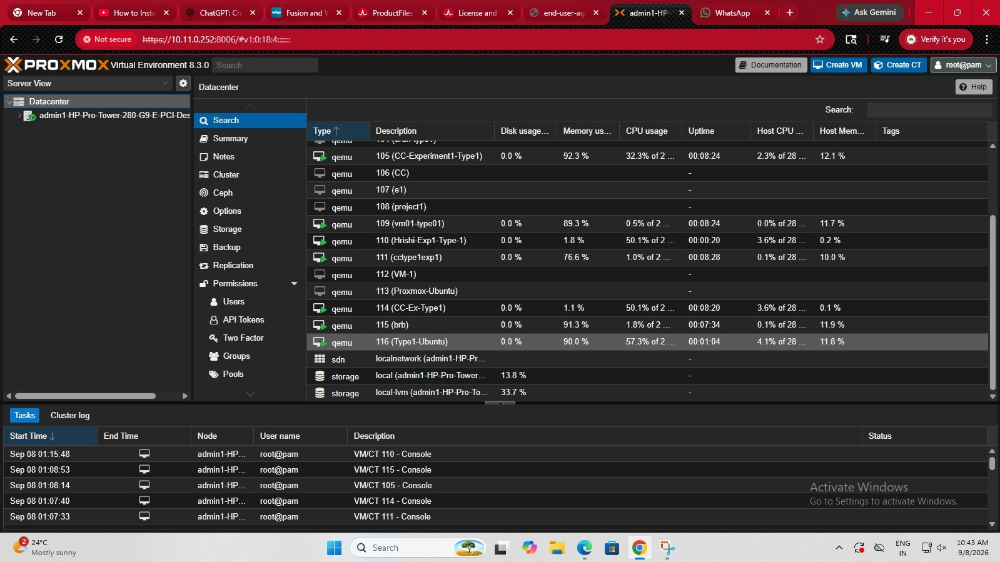

# Hypervisor Performance Analysis

## 1. Objective

To analyze and compare the CPU performance of an Ubuntu Virtual Machine (VM) running on a **Type-1 hypervisor** and a **Type-2 hypervisor** using the same VM configuration and CPU benchmark.

The experiment uses:

* **Type-1 Hypervisor:** Proxmox VE
* **Type-2 Hypervisor:** VMware Workstation
* **Guest Operating System:** Ubuntu
* **CPU Benchmark:** Sysbench

---

## 2. Problem Statement

Virtual machines can run using different types of hypervisors. A Type-1 hypervisor runs directly on physical hardware, while a Type-2 hypervisor runs on top of a host operating system.

This experiment studies the CPU performance of an Ubuntu VM in both environments using the same VM resources and the same Sysbench CPU benchmark.

The benchmark results are recorded and compared to understand the performance characteristics of the two hypervisor types.

---

## 3. Hypervisors Used

| Hypervisor         | Type   | Runs On               |
| ------------------ | ------ | --------------------- |
| Proxmox VE         | Type-1 | Physical hardware     |
| VMware Workstation | Type-2 | Host operating system |

### Type-1 Hypervisor

A Type-1 hypervisor, also called a **bare-metal hypervisor**, runs directly on the physical hardware.

```text
Physical Hardware
       ↓
   Proxmox VE
       ↓
 Ubuntu Virtual Machine
       ↓
 Sysbench CPU Benchmark
       ↓
 Performance Result
```

### Type-2 Hypervisor

A Type-2 hypervisor runs as an application on top of a host operating system.

```text
Physical Hardware
       ↓
    Windows OS
       ↓
VMware Workstation
       ↓
 Ubuntu Virtual Machine
       ↓
 Sysbench CPU Benchmark
       ↓
 Performance Result
```

---

# 4. Virtual Machine Configuration

The same basic VM configuration is used for both hypervisors.

| Resource  | Configuration |
| --------- | ------------- |
| Guest OS  | Ubuntu        |
| CPU       | 2 vCPU        |
| Memory    | 2 GB RAM      |
| Disk      | 20 GB         |
| Benchmark | Sysbench CPU  |

Using the same VM resources helps maintain consistent experimental conditions.

---

# 5. Type-1 Hypervisor – Proxmox VE

## 5.1 Configuration

* **Hypervisor:** Proxmox VE
* **Hypervisor Type:** Type-1
* **Guest OS:** Ubuntu
* **CPU:** 2 vCPU
* **Memory:** 2 GB RAM
* **Disk:** 20 GB
* **Benchmark:** Sysbench CPU

## 5.2 Working

```text
Physical Hardware
       ↓
   Proxmox VE
       ↓
 Ubuntu Virtual Machine
       ↓
 Sysbench CPU Benchmark
       ↓
 Performance Result
```

## 5.3 Proxmox VM Screenshots

### VM Configuration

The screenshot shows the configuration of the Ubuntu VM in Proxmox VE.


### VM Running

The screenshot shows the Ubuntu VM running on Proxmox VE.



### Ubuntu Console

The screenshot shows the Ubuntu console running inside the Proxmox VM.


---

# 6. Type-2 Hypervisor – VMware Workstation

## 6.1 Configuration

* **Hypervisor:** VMware Workstation
* **Hypervisor Type:** Type-2
* **Host OS:** Windows
* **Guest OS:** Ubuntu
* **CPU:** 2 vCPU
* **Memory:** 2 GB RAM
* **Disk:** 20 GB
* **Network:** NAT
* **Benchmark:** Sysbench CPU

## 6.2 Working

```text
Physical Hardware
       ↓
    Windows OS
       ↓
VMware Workstation
       ↓
 Ubuntu Virtual Machine
       ↓
 Sysbench CPU Benchmark
       ↓
 Performance Result
```

## 6.3 VMware Screenshots

VMware screenshots will be added to the project as the Type-2 experiment is completed.

The planned screenshots include:

1. VMware VM configuration
2. VMware VM running
3. Ubuntu console
4. Sysbench CPU result

---

# 7. Experiment Workflow

The same general procedure is followed for both hypervisors.

```text
Select Hypervisor
       ↓
Configure Virtual Machine
       ↓
Install Ubuntu
       ↓
Assign VM Resources
       ↓
Start Virtual Machine
       ↓
Install Sysbench
       ↓
Run CPU Benchmark
       ↓
Record Benchmark Results
       ↓
Store Screenshots
       ↓
Compare Results
```

---

# 8. CPU Benchmark Using Sysbench

**Sysbench** is used to perform the CPU benchmark inside the Ubuntu virtual machine.

## 8.1 Install Sysbench

Run the following commands inside the respective Ubuntu VM:

```bash
sudo apt update
```

```bash
sudo apt install sysbench -y
```

## 8.2 Check Installation

```bash
sysbench --version
```

## 8.3 Run CPU Benchmark

```bash
sysbench cpu --cpu-max-prime=20000 run
```

The same benchmark command is used for both Proxmox and VMware environments.

---

# 9. Benchmark Metrics

The Sysbench CPU benchmark provides several measurements.

| Metric            | Description                                |
| ----------------- | ------------------------------------------ |
| Total Time        | Total time taken to complete the benchmark |
| Total Events      | Number of CPU operations completed         |
| Events Per Second | Number of events processed per second      |
| Average Latency   | Average time taken for an operation        |
| Maximum Latency   | Highest recorded operation latency         |

---

# 10. Results

The actual benchmark values are recorded after running Sysbench inside each Ubuntu VM.

| Metric            | Proxmox VE     | VMware Workstation |
| ----------------- | -------------- | ------------------ |
| Total Time        | To be recorded | To be recorded     |
| Total Events      | To be recorded | To be recorded     |
| Events Per Second | To be recorded | To be recorded     |
| Average Latency   | To be recorded | To be recorded     |
| Maximum Latency   | To be recorded | To be recorded     |

> The values in this table will be filled using the actual Sysbench output obtained from the respective virtual machines.

---

# 11. Hypervisor Comparison

| Feature                  | Type-1: Proxmox VE | Type-2: VMware Workstation |
| ------------------------ | ------------------ | -------------------------- |
| Hypervisor Type          | Type-1             | Type-2                     |
| Runs On                  | Physical hardware  | Host operating system      |
| Host OS Below Hypervisor | Not required       | Required                   |
| Guest OS                 | Ubuntu             | Ubuntu                     |
| CPU                      | 2 vCPU             | 2 vCPU                     |
| Memory                   | 2 GB RAM           | 2 GB RAM                   |
| Disk                     | 20 GB              | 20 GB                      |
| Benchmark                | Sysbench CPU       | Sysbench CPU               |

The performance comparison is based on the actual benchmark measurements collected from both virtual machines.

---

# 12. Screenshot Storage Structure

All screenshots related to the experiment are stored inside the `screenshots` directory.

```text
Hypervisor-Performance-Analysis/
│
├── README.md
│
├── screenshots/
│   │
│   ├── comparison/
│   │
│   ├── type1-proxmox/
│   │
│   ├── type2-vmware/
│   │
│   ├── proxmox-vm-configuration.png
│   ├── proxmox-vm-running.png
│   └── proxmox-ubuntu-console.png
│
├── type1-proxmox/
│
└── type2-vmware/
```

## Screenshot Categories

| Location                       | Purpose                               |
| ------------------------------ | ------------------------------------- |
| `screenshots/comparison/`      | Screenshots related to comparison     |
| `screenshots/type1-proxmox/`   | Additional Type-1 Proxmox screenshots |
| `screenshots/type2-vmware/`    | Additional Type-2 VMware screenshots  |
| `proxmox-vm-configuration.png` | Proxmox VM configuration              |
| `proxmox-vm-running.png`       | Proxmox VM running                    |
| `proxmox-ubuntu-console.png`   | Ubuntu console inside Proxmox         |

Additional screenshots can be added to the appropriate folders as the experiment progresses.

---

# 13. Project Directory Structure

```text
Hypervisor-Performance-Analysis/
│
├── README.md
│
├── screenshots/
│   ├── comparison/
│   ├── type1-proxmox/
│   ├── type2-vmware/
│   ├── proxmox-vm-configuration.png
│   ├── proxmox-vm-running.png
│   └── proxmox-ubuntu-console.png
│
├── type1-proxmox/
│
└── type2-vmware/
```

The project is organized into separate sections for documentation, screenshots, Type-1 experiments, and Type-2 experiments.

---

# 14. Tools and Technologies

The following tools and technologies are used:

* **Proxmox VE** – Type-1 hypervisor
* **VMware Workstation** – Type-2 hypervisor
* **Ubuntu** – Guest operating system
* **Sysbench** – CPU benchmarking tool
* **Windows** – Host operating system for VMware Workstation
* **Git** – Version control
* **GitHub** – Project repository and documentation

---

# 15. Experimental Conditions

To maintain consistency between the two experiments:

* The same guest operating system is used.
* The same CPU allocation is used.
* The same memory allocation is used.
* The same disk size is used.
* The same Sysbench CPU benchmark is used.
* The same benchmark parameter is used.
* Benchmark results are collected from inside the respective Ubuntu VM.
* Screenshots are stored as evidence of the experiment setup and execution.

---

# 16. Evidence Collected

The experiment documentation includes:

### Type-1 – Proxmox VE

* VM configuration screenshot
* VM running screenshot
* Ubuntu console screenshot
* Sysbench benchmark result

### Type-2 – VMware Workstation

* VM configuration screenshot
* VM running screenshot
* Ubuntu console screenshot
* Sysbench benchmark result

These screenshots provide visual evidence of the VM configuration, execution environment, and benchmark process.

---

# 17. Expected Output

The experiment produces:

1. VM configuration evidence
2. VM execution evidence
3. Ubuntu console evidence
4. Sysbench CPU benchmark results
5. Comparison of measured CPU performance between the two hypervisor environments

---

# 18. Conclusion

This experiment provides a practical comparison of CPU performance when running an Ubuntu virtual machine using a Type-1 hypervisor and a Type-2 hypervisor.

The comparison is performed under controlled VM resource configurations using the same Sysbench CPU benchmark. The final observations are based on the actual benchmark measurements collected from both environments.

The experiment also demonstrates the basic working, configuration, benchmarking, documentation, and evidence collection process for virtual machines running on different hypervisor types.

