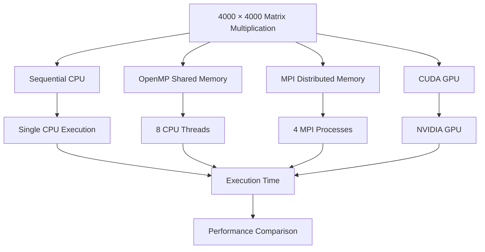
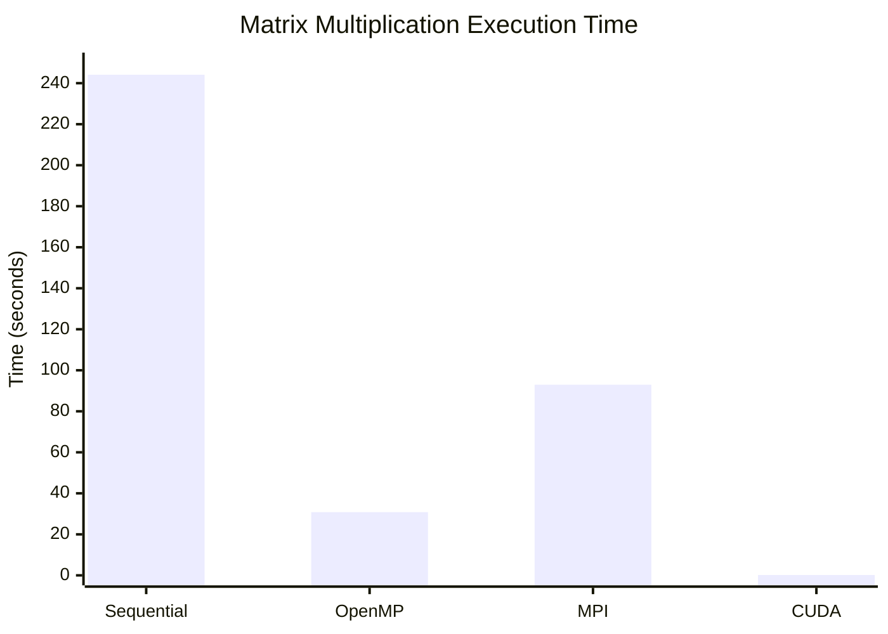
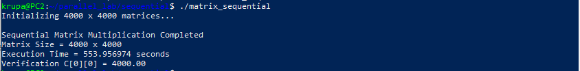
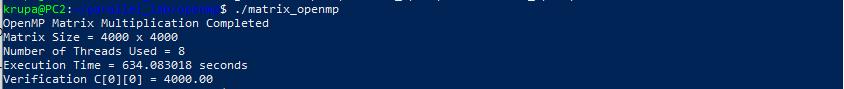
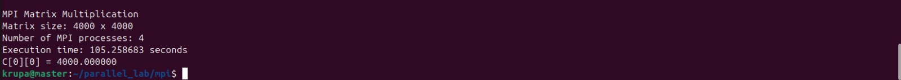

# Matrix Multiplication using Sequential, OpenMP, MPI and CUDA

A Parallel and Distributed Computing laboratory experiment implementing **4000 × 4000 matrix multiplication** using four different computing models:

1. Sequential CPU execution
2. OpenMP shared-memory parallelism
3. MPI distributed-memory parallelism
4. CUDA GPU parallelism

The experiment compares the execution time, speedup, resource configuration, and execution model of all four implementations while maintaining the same mathematical problem and verification value.

---

## Table of Contents

* [1. Problem Statement](#1-problem-statement)
* [2. Objectives](#2-objectives)
* [3. Components and Configuration](#3-components-and-configuration)
* [4. Problem Definition](#4-problem-definition)
* [5. System Architecture](#5-system-architecture)
* [6. Overall Execution Flow](#6-overall-execution-flow)
* [7. Part A - Sequential Matrix Multiplication](#7-part-a---sequential-matrix-multiplication)

  * [7.1 Prerequisites](#71-prerequisites)
  * [7.2 WSL Verification](#72-wsl-verification)
  * [7.3 GCC Setup](#73-gcc-setup)
  * [7.4 Source Code](#74-source-code)
  * [7.5 Compilation and Execution](#75-compilation-and-execution)
  * [7.6 Sequential Result](#76-sequential-result)
* [8. Part B - OpenMP Matrix Multiplication](#8-part-b---openmp-matrix-multiplication)

  * [8.1 Configuration](#81-configuration)
  * [8.2 OpenMP Setup](#82-openmp-setup)
  * [8.3 Source Code](#83-source-code)
  * [8.4 Compilation and Execution](#84-compilation-and-execution)
  * [8.5 OpenMP Result](#85-openmp-result)
* [9. Part C - MPI Distributed Matrix Multiplication](#9-part-c---mpi-distributed-matrix-multiplication)

  * [9.1 Cluster Configuration](#91-cluster-configuration)
  * [9.2 Network and SSH Setup](#92-network-and-ssh-setup)
  * [9.3 MPI Configuration](#93-mpi-configuration)
  * [9.4 Source Code](#94-source-code)
  * [9.5 Compilation and Execution](#95-compilation-and-execution)
  * [9.6 MPI Data Flow](#96-mpi-data-flow)
  * [9.7 MPI Result](#97-mpi-result)
* [10. Part D - CUDA Matrix Multiplication](#10-part-d---cuda-matrix-multiplication)

  * [10.1 CUDA Configuration](#101-cuda-configuration)
  * [10.2 GPU and CUDA Verification](#102-gpu-and-cuda-verification)
  * [10.3 Source Code](#103-source-code)
  * [10.4 Compilation and Execution](#104-compilation-and-execution)
  * [10.5 CUDA Execution Configuration](#105-cuda-execution-configuration)
  * [10.6 CUDA Result](#106-cuda-result)
* [11. Results](#11-results)
* [12. Performance Analysis](#12-performance-analysis)

  * [12.1 Speedup](#121-speedup)
  * [12.2 Execution Time Comparison](#122-execution-time-comparison)
  * [12.3 Performance Graph](#123-performance-graph)
  * [12.4 Observations](#124-observations)
* [13. Troubleshooting](#13-troubleshooting)
* [14. Conclusion](#14-conclusion)
* [15. Author](#15-author)

---

# 1. Problem Statement

Matrix multiplication is a computationally intensive operation that can benefit significantly from parallel and distributed computing.

For this experiment, two matrices `A` and `B` of size **4000 × 4000** are multiplied to produce matrix `C`.

The same matrix multiplication problem is implemented using:

* Sequential CPU execution
* OpenMP shared-memory parallelism
* MPI distributed-memory parallelism
* CUDA GPU parallelism

The execution time of each implementation is measured and compared with the sequential implementation as the baseline.

The experiment demonstrates how different parallel computing models distribute computational work and how communication, memory organization, and hardware architecture affect execution performance.

---

# 2. Objectives

The objectives of this experiment are:

1. To implement matrix multiplication using sequential programming.
2. To establish the sequential implementation as a performance baseline.
3. To parallelize matrix multiplication using OpenMP.
4. To distribute matrix multiplication across multiple processes using MPI.
5. To execute matrix multiplication on an NVIDIA GPU using CUDA.
6. To understand shared-memory, distributed-memory, and GPU-based parallelism.
7. To measure execution time for all implementations.
8. To calculate speedup relative to the sequential implementation.
9. To compare the performance characteristics of Sequential, OpenMP, MPI, and CUDA implementations.
10. To verify that all implementations produce the same mathematical result.

---

# 3. Components and Configuration

## 3.1 Hardware Requirements

| Component   | Configuration                     |
| ----------- | --------------------------------- |
| Host System | Windows 10/11                     |
| CPU         | Multi-core processor              |
| RAM         | Sufficient memory for WSL and VMs |
| MPI Nodes   | 4 Ubuntu virtual machines         |
| GPU         | NVIDIA RTX 4500 Ada Generation    |
| Network     | VMware virtual network            |

## 3.2 Software Requirements

| Software           | Purpose                                  |
| ------------------ | ---------------------------------------- |
| Windows PowerShell | WSL verification and launch              |
| WSL2               | Linux environment for CPU experiments    |
| Ubuntu             | Compilation and execution environment    |
| GCC                | C compilation                            |
| OpenMP             | Shared-memory parallel programming       |
| Open MPI           | Distributed-memory parallel programming  |
| OpenSSH            | MPI remote process launching             |
| VMware Workstation | MPI virtual machine cluster              |
| CUDA Toolkit       | GPU programming                          |
| `nvcc`             | CUDA compilation                         |
| Git                | Version control                          |
| GitHub             | Source-code and documentation repository |

---

# 4. Problem Definition

The experiment uses two matrices:

```text
A = 4000 × 4000
B = 4000 × 4000
C = A × B
```

Every element of matrices `A` and `B` is initialized to `1.0`.

Therefore:

```text
C[i][j] = Σ A[i][k] × B[k][j]
```

For every output element:

```text
C[i][j] = 1×1 + 1×1 + ... + 1×1
```

There are 4000 terms.

Therefore:

```text
C[i][j] = 4000.00
```

The expected verification value is:

```text
C[0][0] = 4000.00
```

All four implementations are expected to produce this value.

---

# 5. System Architecture

The experiment uses four different execution models for the same mathematical problem.



## 5.1 Sequential Architecture

```text
CPU
 |
 +---- Matrix A
 |
 +---- Matrix B
 |
 +---- Matrix Multiplication
 |
 +---- Matrix C
```

The entire computation is executed sequentially by one CPU execution flow.

---

## 5.2 OpenMP Architecture

```text
                Shared Memory
                     |
        +------------+------------+
        |            |            |
     Thread 1     Thread 2    ... Thread 8
        |            |            |
        +------------+------------+
                     |
              Matrix Multiplication
```

The outer loop of the matrix multiplication is divided among multiple OpenMP threads.

---

## 5.3 MPI Architecture

```text
                    Master
                  Rank 0
               192.168.125.128
                     |
       +-------------+-------------+
       |             |             |
    Worker 1      Worker 2      Worker 3
     Rank 1        Rank 2        Rank 3
  .125.129      .125.130      .125.131
```

Each MPI process has its own memory space.

Matrix `A` is divided into row blocks and distributed using `MPI_Scatter`.

Matrix `B` is distributed to all ranks using `MPI_Bcast`.

Partial results are collected using `MPI_Gather`.

---

## 5.4 CUDA Architecture

```text
                 CPU
                  |
          Host Matrices A, B
                  |
          Host-to-Device Copy
                  |
                  v
             NVIDIA GPU
                  |
          +-------+-------+
          |       |       |
        Block   Block   Block
          |       |       |
       Threads Threads Threads
          |       |       |
          +-------+-------+
                  |
            Matrix C
                  |
          Device-to-Host Copy
                  |
                  v
                 CPU
```

Each CUDA thread computes one output element of matrix `C`.

---

# 6. Overall Execution Flow

```text
Windows PowerShell
        |
        v
     WSL2 Ubuntu
        |
        v
Sequential CPU Baseline
        |
        v
OpenMP Shared Memory
        |
        v
MPI Distributed Memory
        |
        v
CUDA GPU Parallelism
        |
        v
Results and Speedup Comparison
```

The same matrix size and mathematical operation are maintained across all four implementations.

---

# 7. Part A - Sequential Matrix Multiplication

The sequential implementation is used as the baseline for performance comparison.

## 7.1 Prerequisites

* Windows PowerShell
* WSL2
* Ubuntu
* Internet connection
* `sudo` access
* GCC / build-essential

---

## 7.2 WSL Verification

Open **Windows PowerShell**.

Check WSL:

```bash
wsl --status
```

List installed distributions:

```bash
wsl -l -v
```

The Ubuntu distribution should preferably show WSL version `2`.

Start Ubuntu:

```bash
wsl
```

The terminal should change to an Ubuntu shell.

---

## 7.3 GCC Setup

Inside Ubuntu:

```bash
sudo apt update
```

Install build tools:

```bash
sudo apt install build-essential -y
```

Verify GCC:

```bash
gcc --version
```

---

## 7.4 Source Code

The sequential source code is available in:

```text
sequential/matrix_sequential.c
```

The implementation:

* Allocates matrices `A`, `B`, and `C`
* Initializes `A` and `B` to `1.0`
* Performs standard triple-loop matrix multiplication
* Measures execution time using `clock()`
* Verifies `C[0][0]`

---

## 7.5 Compilation and Execution

Create the directory:

```bash
mkdir -p ~/parallel_lab/sequential
cd ~/parallel_lab/sequential
```

Compile:

```bash
gcc -O2 matrix_sequential.c -o matrix_sequential
```

Run:

```bash
./matrix_sequential
```

---

## 7.6 Sequential Result

```text
Initializing 4000 x 4000 matrices...

Sequential Matrix Multiplication Completed
Matrix Size = 4000 x 4000
Execution Time = 244.120000 seconds
Verification C[0][0] = 4000.00
```

**Recorded execution time:** `244.120000 seconds`

This value is used as the baseline for speedup calculations.

---

# 8. Part B - OpenMP Matrix Multiplication

OpenMP implements shared-memory parallelism using multiple CPU threads.

## 8.1 Configuration

| Parameter       | Value         |
| --------------- | ------------- |
| Matrix Size     | 4000 × 4000   |
| Execution Model | Shared Memory |
| Threads         | 8             |
| Compiler        | GCC           |
| OpenMP Flag     | `-fopenmp`    |

---

## 8.2 OpenMP Setup

Start WSL:

```bash
wsl
```

Check available logical CPUs:

```bash
nproc
```

Set eight OpenMP threads:

```bash
export OMP_NUM_THREADS=8
```

Verify:

```bash
echo $OMP_NUM_THREADS
```

Expected:

```text
8
```

---

## 8.3 Source Code

The OpenMP source code is available in:

```text
openmp/matrix_openmp.c
```

The program uses:

```c
#pragma omp parallel for private(j, k)
```

to divide the outer matrix loop among OpenMP threads.

---

## 8.4 Compilation and Execution

Create the directory:

```bash
mkdir -p ~/parallel_lab/openmp
cd ~/parallel_lab/openmp
```

Compile:

```bash
gcc -O2 -fopenmp matrix_openmp.c -o matrix_openmp
```

Run:

```bash
./matrix_openmp
```

CPU utilization can be monitored using:

```bash
htop
```

---

## 8.5 OpenMP Result

```text
OpenMP Matrix Multiplication Completed
Matrix Size = 4000 x 4000
Number of Threads Used = 8
Execution Time = 30.830434 seconds
Verification C[0][0] = 4000.00
```

**Recorded execution time:** `30.830434 seconds`

---

# 9. Part C - MPI Distributed Matrix Multiplication

MPI uses multiple independent processes with separate memory spaces.

The experiment uses four Ubuntu virtual machines:

* One Master
* Three Workers

---

## 9.1 Cluster Configuration

| Node     | Hostname  | IP Address        | MPI Role |
| -------- | --------- | ----------------- | -------- |
| Master   | `master`  | `192.168.125.128` | Rank 0   |
| Worker 1 | `worker1` | `192.168.125.129` | Rank 1   |
| Worker 2 | `worker2` | `192.168.125.130` | Rank 2   |
| Worker 3 | `worker3` | `192.168.125.131` | Rank 3   |

Each rank processes:

```text
4000 / 4 = 1000 rows
```

Therefore:

```text
Rank 0 → 1000 rows
Rank 1 → 1000 rows
Rank 2 → 1000 rows
Rank 3 → 1000 rows
```

---

## 9.2 Network and SSH Setup

On each Ubuntu VM, assign a unique hostname.

Master:

```bash
sudo hostnamectl set-hostname master
```

Worker 1:

```bash
sudo hostnamectl set-hostname worker1
```

Worker 2:

```bash
sudo hostnamectl set-hostname worker2
```

Worker 3:

```bash
sudo hostnamectl set-hostname worker3
```

Check the IP address:

```bash
hostname -I
```

From Master, verify connectivity:

```bash
ping -c 4 192.168.125.129
ping -c 4 192.168.125.130
ping -c 4 192.168.125.131
```

---

## 9.3 MPI Configuration

Install OpenSSH on all nodes:

```bash
sudo apt update
sudo apt install openssh-server -y
sudo systemctl enable --now ssh
```

Install Open MPI:

```bash
sudo apt update
sudo apt install openmpi-bin libopenmpi-dev -y
```

Verify:

```bash
mpicc --version
mpirun --version
```

Generate an SSH key on Master:

```bash
ssh-keygen -t rsa
```

Copy the key to Workers:

```bash
ssh-copy-id worker1
ssh-copy-id worker2
ssh-copy-id worker3
```

Test passwordless SSH:

```bash
ssh worker1 hostname
ssh worker2 hostname
ssh worker3 hostname
```

---

## 9.4 MPI Configuration File

The MPI hostfile contains:

```text
master slots=1
worker1 slots=1
worker2 slots=1
worker3 slots=1
```

The MPI source code is available in:

```text
mpi/matrix_mpi.c
```

The program uses:

```text
MPI_Scatter
MPI_Bcast
MPI_Gather
MPI_Barrier
```

to distribute and collect matrix data.

---

## 9.5 Compilation and Execution

Compile on Master:

```bash
mpicc -O2 matrix_mpi.c -o matrix_mpi
```

Copy the executable:

```bash
scp matrix_mpi worker1:~/matrix_mpi
scp matrix_mpi worker2:~/matrix_mpi
scp matrix_mpi worker3:~/matrix_mpi
```

Run four MPI processes:

```bash
mpirun -np 4 --hostfile hosts sh -c '$HOME/matrix_mpi'
```

---

## 9.6 MPI Data Flow

```text
                    Matrix A
                       |
                 MPI_Scatter
                       |
        +--------------+--------------+
        |              |              |
      Rank 0         Rank 1         Rank 2         Rank 3
    1000 rows      1000 rows      1000 rows      1000 rows
        |              |              |              |
        +--------------+--------------+--------------+
                       |
                Local Computation
                       |
                       v

Matrix B ---- MPI_Bcast ----> All MPI Ranks

                       |
                       v

                  Local C
                       |
                 MPI_Gather
                       |
                       v
                Complete Matrix C
                    Rank 0
```

---

## 9.7 MPI Result

```text
MPI Matrix Multiplication Completed
Matrix Size = 4000 x 4000
Number of MPI Processes = 4
Execution Time = 92.979510 seconds
Verification C[0][0] = 4000.00
```

**Recorded execution time:** `92.979510 seconds`

The measured time includes the MPI communication involved in distributing and collecting the matrix data.

---

# 10. Part D - CUDA Matrix Multiplication

CUDA is used to execute matrix multiplication on an NVIDIA GPU.

The CPU prepares the input matrices, transfers them to GPU memory, launches the CUDA kernel, and copies the result back to host memory.

---

## 10.1 CUDA Configuration

| Parameter         | Configuration                  |
| ----------------- | ------------------------------ |
| Matrix Size       | 4000 × 4000                    |
| GPU               | NVIDIA RTX 4500 Ada Generation |
| Block Size        | 16 × 16                        |
| Threads per Block | 256                            |
| Grid Size         | 250 × 250                      |
| Total Blocks      | 62,500                         |
| Logical Threads   | 16,000,000                     |

---

## 10.2 GPU and CUDA Verification

Check the NVIDIA GPU:

```bash
nvidia-smi
```

Verify CUDA compiler:

```bash
nvcc --version
```

Create the CUDA directory:

```bash
mkdir -p ~/parallel_lab/cuda
cd ~/parallel_lab/cuda
```

---

## 10.3 Source Code

The CUDA source code is available in:

```text
cuda/matrix_cuda.cu
```

The CUDA kernel calculates one output element per logical CUDA thread.

The kernel uses:

```text
block = 16 × 16
grid  = 250 × 250
```

---

## 10.4 Compilation and Execution

Compile:

```bash
nvcc -O2 matrix_cuda.cu -o matrix_cuda
```

Run:

```bash
./matrix_cuda
```

The program measures:

* CUDA kernel execution time
* Total CUDA phase time
* Matrix verification

The recorded total CUDA phase includes host-to-device transfer, kernel execution, and device-to-host transfer.

---

## 10.5 CUDA Execution Configuration

For a 4000 × 4000 matrix:

```text
4000 / 16 = 250
```

Therefore:

```text
Grid = 250 × 250 blocks
```

Each block contains:

```text
16 × 16 = 256 threads
```

Total blocks:

```text
250 × 250 = 62,500 blocks
```

Logical thread instances:

```text
62,500 × 256 = 16,000,000
```

The logical threads correspond to the output elements of the 4000 × 4000 matrix.

---

## 10.6 CUDA Result

```text
CUDA Matrix Multiplication Completed
Matrix Size = 4000 x 4000
Grid Size = 250 x 250 blocks
Block Size = 16 x 16 threads
Kernel Execution Time = 0.146443 seconds
Total CUDA Phase Time = 0.165004 seconds
Verification C[0][0] = 4000.00
```

**Kernel-only time:** `0.146443 seconds`

**Total CUDA phase time:** `0.165004 seconds`

For performance comparison with the CPU implementations, the total CUDA phase time is used.

---

# 11. Results

All four implementations produced the expected verification value:

```text
C[0][0] = 4000.00
```

## 11.1 Overall Results

| Implementation | Computing Model      | Resources            | Execution Time | Verification |
| -------------- | -------------------- | -------------------- | -------------: | -----------: |
| Sequential     | Single CPU execution | 1 CPU execution flow |   244.120000 s |      4000.00 |
| OpenMP         | Shared memory        | 8 CPU threads        |    30.830434 s |      4000.00 |
| MPI            | Distributed memory   | 4 processes / 4 VMs  |    92.979510 s |      4000.00 |
| CUDA           | GPU parallelism      | NVIDIA RTX 4500 Ada  |     0.165004 s |      4000.00 |

---

# 12. Performance Analysis

## 12.1 Speedup

Speedup is calculated using:

```text
Speedup = Sequential Execution Time / Parallel Execution Time
```

Sequential execution time:

```text
244.120000 seconds
```

### Speedup Table

| Implementation | Execution Time |  Speedup |
| -------------- | -------------: | -------: |
| Sequential     |   244.120000 s |    1.00× |
| OpenMP         |    30.830434 s |    7.92× |
| MPI            |    92.979510 s |    2.63× |
| CUDA           |     0.165004 s | 1479.48× |

---

## 12.2 Execution Time Comparison

The measured execution times show substantial differences between the four execution models.

| Model      | Time (seconds) | Relative to Sequential |
| ---------- | -------------: | ---------------------: |
| Sequential |     244.120000 |                  1.00× |
| OpenMP     |      30.830434 |          7.92× speedup |
| MPI        |      92.979510 |          2.63× speedup |
| CUDA       |       0.165004 |       1479.48× speedup |

The CUDA comparison uses **total CUDA phase time**, rather than kernel-only time, so that host-device transfers are included in the reported CUDA measurement.

---

## 12.3 Performance Graph

The following graph represents the recorded execution times.



Because the CUDA execution time is much smaller than the CPU and MPI times, its bar is visually compressed when all results are displayed on the same linear scale.

---

## 12.4 Performance Observations

### Sequential

The sequential implementation provides the baseline execution time because the complete computation is performed using one CPU execution flow.

Recorded time:

```text
244.120000 seconds
```

### OpenMP

OpenMP divides the outer matrix loop among eight CPU threads.

Recorded time:

```text
30.830434 seconds
```

The measured speedup relative to the sequential baseline is approximately:

```text
7.92×
```

### MPI

MPI distributes the matrix rows across four independent processes running on four Ubuntu virtual machines.

Recorded time:

```text
92.979510 seconds
```

The measured speedup relative to the sequential baseline is approximately:

```text
2.63×
```

MPI also requires communication between processes, including:

```text
MPI_Scatter
MPI_Bcast
MPI_Gather
```

The experiment therefore includes communication and virtual-network overhead in its measured execution.

### CUDA

CUDA executes the matrix multiplication on the NVIDIA GPU using a large number of logical threads.

Recorded total CUDA phase time:

```text
0.165004 seconds
```

The recorded kernel-only time is:

```text
0.146443 seconds
```

Using the total CUDA phase time, the measured speedup relative to the sequential baseline is:

```text
1479.48×
```

---

# 13. Troubleshooting

| Problem                   | Solution                                                                       |
| ------------------------- | ------------------------------------------------------------------------------ |
| `wsl` command not found   | Verify WSL installation using `wsl --status`.                                  |
| Ubuntu does not start     | Run `wsl --shutdown`, then start WSL again.                                    |
| `gcc` command not found   | Run `sudo apt update` and `sudo apt install build-essential -y`.               |
| OpenMP compilation fails  | Ensure `-fopenmp` is included in the GCC command.                              |
| OpenMP uses fewer threads | Check `nproc` and `echo $OMP_NUM_THREADS`.                                     |
| MPI ping fails            | Verify that all VMs use the same virtual network and check their IP addresses. |
| SSH asks for a password   | Run `ssh-copy-id` from Master to each Worker.                                  |
| MPI workers cannot launch | Verify hostnames, SSH access, hostfile entries, and executable availability.   |
| `mpicc` not found         | Install `openmpi-bin` and `libopenmpi-dev`.                                    |
| `nvidia-smi` fails        | Verify that the NVIDIA driver is installed and the GPU is visible.             |
| `nvcc` command not found  | Verify CUDA Toolkit installation and PATH configuration.                       |
| CUDA compilation fails    | Verify CUDA Toolkit and supported host compiler configuration.                 |

---

# 14. Conclusion

This experiment implemented the same **4000 × 4000 matrix multiplication** problem using four different computing models:

* Sequential CPU execution
* OpenMP shared-memory parallelism
* MPI distributed-memory parallelism
* CUDA GPU parallelism

The sequential implementation established the baseline execution time of **244.120000 seconds**.

OpenMP used eight CPU threads and recorded an execution time of **30.830434 seconds**.

MPI distributed the workload across four Ubuntu virtual machines and recorded an execution time of **92.979510 seconds**.

CUDA executed the computation on an NVIDIA RTX 4500 Ada Generation GPU. The recorded total CUDA phase time was **0.165004 seconds**, while the kernel-only time was **0.146443 seconds**.

All four implementations produced the same verification result:

```text
C[0][0] = 4000.00
```

The experiment demonstrates the differences between sequential, shared-memory, distributed-memory, and GPU-based parallel computing while keeping the mathematical workload consistent.

---

# 15. Author

**Krupa**

CSE (Artificial Intelligence)
K.L.E. Technological University, Hubli

---

## Repository Structure

```text
PGC-Experiment-1-matrix-multiplication-lab/
│
├── README.md
│
├── sequential/
│   └── matrix_sequential.c
│
├── openmp/
│   └── matrix_openmp.c
│
├── mpi/
│   └── matrix_mpi.c
│
├── cuda/
│   └── matrix_cuda.cu
│
└── screenshots/
    ├── 01_Sequential_Result.png
    ├── 02_OpenMP_Result.png
    ├── 03_MPI_Result.png
    └── 04_CUDA_Result.png
```

## Result Screenshots

### Sequential



### OpenMP



### MPI



### CUDA


