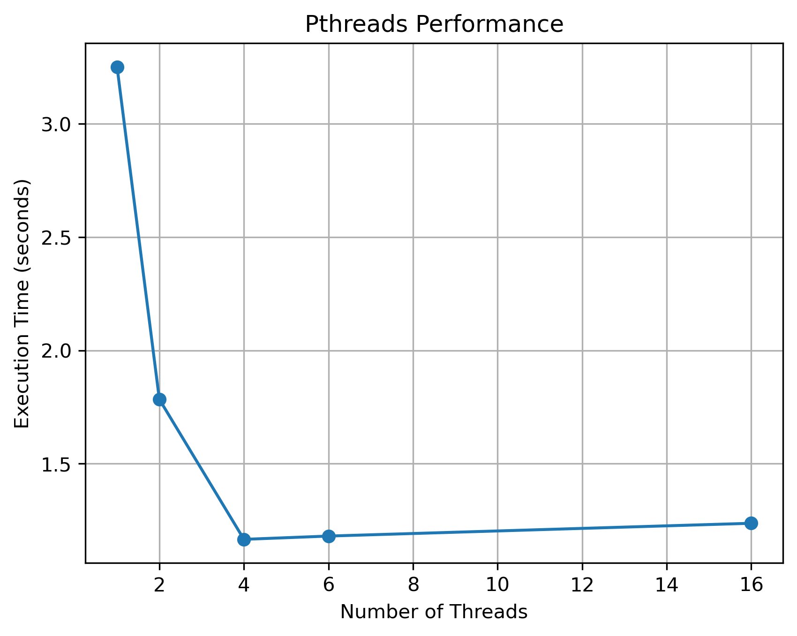
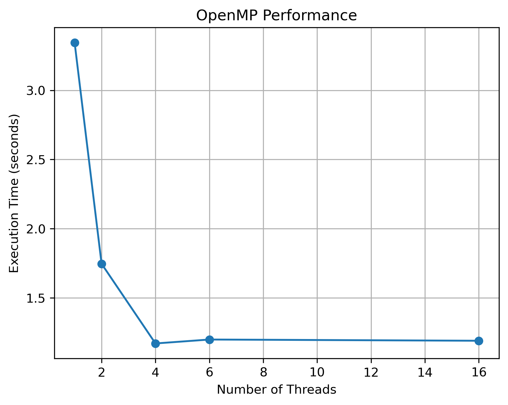
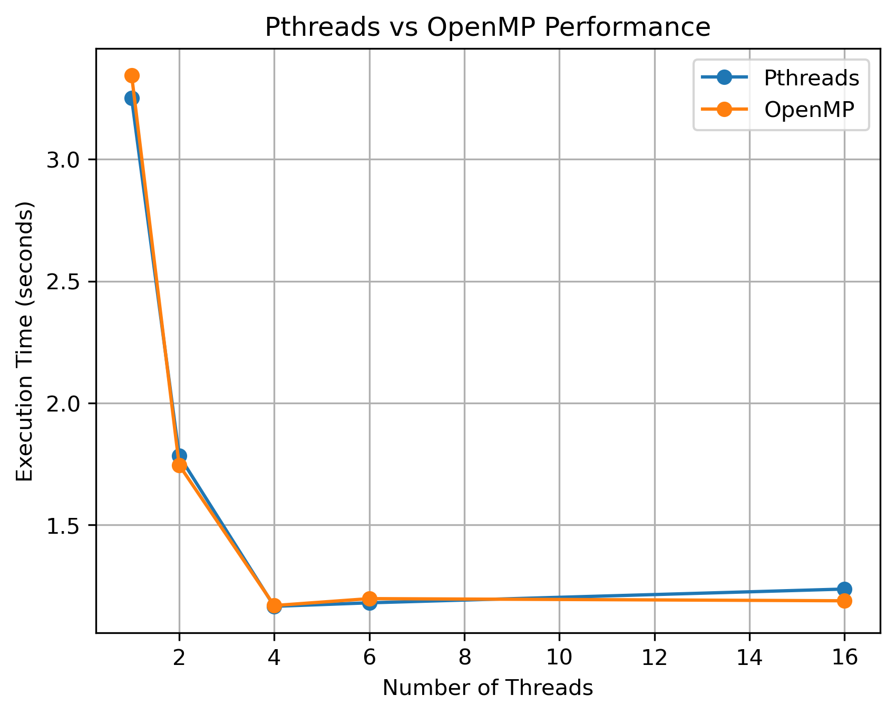

# 🧵 PGC Experiment 2 — Multithreaded Programming Using Pthreads and OpenMP

## Experiment Title

**Develop Multithreaded Programs Using Parallel Programming Libraries to Understand Thread Creation, Management, and Coordination**

# 📑 Table of Contents

* [1. AIM](#1-aim)
* [2. PROBLEM STATEMENT](#2-problem-statement)
* [3. OBJECTIVES](#3-objectives)
* [4. BASIC IDEA](#4-basic-idea)
* [5. SOFTWARE ENVIRONMENT](#5-software-environment)
* [6. EXPERIMENT CONFIGURATION](#6-experiment-configuration)
* [7. ARCHITECTURE](#7-architecture)
* [8. STARTING WSL](#8-starting-wsl)
* [9. CREATE / OPEN THE LAB DIRECTORY](#9-create--open-the-lab-directory)
* [10. CHECK GCC](#10-check-gcc)
* [11. CHECK OPENMP SUPPORT](#11-check-openmp-support)
* [12. DIRECTORY STRUCTURE](#12-directory-structure)

### PART A — PTHREADS

* [13. PTHREADS INTRODUCTION](#13-pthreads-introduction)
* [14. CREATE ONE THREAD](#14-create-one-thread)
* [15. CREATE MULTIPLE THREADS](#15-create-multiple-threads)
* [16. DIVIDE WORK AMONG THREADS](#16-divide-work-among-threads)
* [17. PTHREADS RACE CONDITION](#17-pthreads-race-condition)
* [18. FIX RACE CONDITION USING MUTEX](#18-fix-race-condition-using-mutex)

### PART B — OPENMP

* [19. OPENMP INTRODUCTION](#19-openmp-introduction)
* [20. OPENMP BASIC PARALLEL REGION](#20-openmp-basic-parallel-region)
* [21. OPENMP WORK SHARING AND REDUCTION](#21-openmp-work-sharing-and-reduction)
* [22. OPENMP RACE CONDITION](#22-openmp-race-condition)
* [23. OPENMP CRITICAL SECTION](#23-openmp-critical-section)
* [24. OPENMP BARRIER](#24-openmp-barrier)

### PART C — PERFORMANCE ANALYSIS

* [25. PERFORMANCE OBJECTIVE](#25-performance-objective)
* [26. SEQUENTIAL BASELINE](#26-sequential-baseline)
* [27. PTHREADS PERFORMANCE](#27-pthreads-performance)
* [28. PTHREADS PERFORMANCE RESULTS](#28-pthreads-performance-results)
* [29. OPENMP PERFORMANCE](#29-openmp-performance)
* [30. OPENMP PERFORMANCE RESULTS](#30-openmp-performance-results)
* [31. FINAL PERFORMANCE COMPARISON](#31-final-performance-comparison)
* [32. SPEEDUP](#32-speedup)
* [33. EFFICIENCY](#33-efficiency)
* [34. PERFORMANCE OBSERVATIONS](#34-performance-observations)
* [35. WHY MORE THREADS DO NOT ALWAYS MEAN MORE SPEED](#35-why-more-threads-do-not-always-mean-more-speed)
* [36. PTHREADS VS OPENMP](#36-pthreads-vs-openmp)
* [37. IMPORTANT TERMS](#37-important-terms)
* [38. IMPLEMENTED PROGRAMS](#38-implemented-programs)
* [39. SCREENSHOTS](#39-screenshots)
* [40. GRAPH GENERATION](#40-graph-generation)
* [41. COMPLETE LEARNING FLOW](#41-complete-learning-flow)
* [42. RESULT SUMMARY](#42-result-summary)
* [43. REPOSITORY CONTENT](#43-repository-content)
* [Performance Graphs](#performance-graphs)
* [44. CONCLUSION](#44-conclusion)
* [Author](#author)

---

# 1. AIM

To develop multithreaded programs using **Pthreads and OpenMP** and understand:

* Thread creation
* Thread management
* Work distribution
* Race conditions
* Synchronization
* Thread coordination
* Performance improvement using multiple threads

---

# 2. PROBLEM STATEMENT

Develop and execute multithreaded C programs using **Pthreads and OpenMP** to understand how threads are created, managed, coordinated, and synchronized.

The experiment also demonstrates how work can be distributed among multiple threads, how race conditions occur when shared data is accessed concurrently, and how synchronization mechanisms such as mutexes and critical sections solve these problems.

Finally, measure the execution time of sequential, Pthreads, and OpenMP implementations with different numbers of threads and analyze execution time, speedup, efficiency, and the effect of thread overhead.

---

# 3. OBJECTIVES

The main objectives of this experiment are:

1. To understand the concept of threads and multithreading.
2. To create and manage threads using Pthreads.
3. To create multiple threads and observe their execution.
4. To distribute computational work among multiple threads.
5. To understand shared data and race conditions.
6. To solve race conditions using Pthread mutexes.
7. To understand OpenMP parallel regions.
8. To distribute loop iterations using OpenMP.
9. To use OpenMP reduction for safe accumulation.
10. To solve race conditions using OpenMP critical sections.
11. To coordinate threads using OpenMP barriers.
12. To compare sequential, Pthreads, and OpenMP execution.
13. To calculate speedup and efficiency.
14. To study the effect of increasing the number of threads on execution time.
15. To visualize performance using graphs.

---

# 4. BASIC IDEA

A **thread** is an execution path inside a program.

A thread can be considered as a worker performing part of a task.

## Sequential Execution

```text
              Program
                 |
                 v
             One Thread
                 |
        -------------------
        |       |       |
      Task 1  Task 2  Task 3
```

One thread performs the work sequentially.

## Multithreaded Execution

```text
                 Program
                    |
          ---------------------
          |        |          |
       Thread 1  Thread 2  Thread 3  Thread 4
          |        |          |        |
        Work     Work       Work     Work
```

Multiple threads can work on different parts of a problem concurrently.

This experiment uses two parallel programming technologies:

1. **Pthreads**
2. **OpenMP**

The final part measures whether increasing the number of threads reduces execution time.

---

# 5. SOFTWARE ENVIRONMENT

The experiment was performed using:

| Component             | Configuration            |
| --------------------- | ------------------------ |
| Host Operating System | Windows                  |
| Linux Environment     | WSL Ubuntu               |
| Programming Language  | C                        |
| Compiler              | GCC                      |
| Thread Library        | POSIX Pthreads           |
| Parallel Library      | OpenMP                   |
| Text Editor           | Nano                     |
| Version Control       | Git                      |
| Repository            | `Krupa1310/5th-sem-labs` |

---

# 6. EXPERIMENT CONFIGURATION

The experiment consists of three major parts.

```text
PGC Experiment 2
       |
       +----------------------+
       |                      |
   PART A                   PART B
   Pthreads                 OpenMP
       |                      |
       |                      |
       +----------+-----------+
                  |
                  v
          PART C: PERFORMANCE
                  |
       +----------+----------+
       |          |          |
  Sequential   Pthreads    OpenMP
       |          |          |
       +----------+----------+
                  |
                  v
       Execution Time Analysis
                  |
                  v
              Speedup
                  |
                  v
              Efficiency
                  |
                  v
                Graphs
```

---

# 7. ARCHITECTURE

## 7.1 Overall Architecture

```text
                 Input / Workload
                       |
                       v
              Sequential Baseline
                       |
                       v
             +-------------------+
             | Parallel Workload |
             +-------------------+
                  /         \
                 /           \
                v             v
           Pthreads         OpenMP
              |                |
       Thread Creation    Parallel Region
              |                |
       Work Distribution   Work Sharing
              |                |
       Synchronization     Synchronization
              |                |
              +-------+--------+
                      |
                      v
              Execution Time
                      |
                      v
                  Speedup
                      |
                      v
                  Efficiency
                      |
                      v
                   Graphs
```

## 7.2 Pthreads Architecture

```text
                    Main Thread
                         |
                  pthread_create()
                         |
          +--------------+--------------+
          |              |              |
       Thread 1       Thread 2       Thread 3 ... Thread N
          |              |              |
       Work 1          Work 2          Work 3
          |              |              |
          +--------------+--------------+
                         |
                  pthread_join()
                         |
                         v
                    Final Result
```

Pthreads provides explicit control over:

* Thread creation
* Thread identification
* Thread joining
* Work distribution
* Mutex synchronization

## 7.3 OpenMP Architecture

```text
                    Main Thread
                         |
                 #pragma omp parallel
                         |
              +----------+----------+
              |          |          |
           Thread 0   Thread 1   Thread 2 ... Thread N
              |          |          |
           Work       Work       Work
              |          |          |
              +----------+----------+
                         |
                    Synchronization
                         |
                         v
                    Final Result
```

OpenMP provides higher-level mechanisms through compiler directives such as:

```c
#pragma omp parallel
#pragma omp parallel for
#pragma omp critical
#pragma omp barrier
```

---

# 8. STARTING WSL

## Step 1 — Open PowerShell

On Windows:

1. Press the Windows key.
2. Search for PowerShell.
3. Open Windows PowerShell.

## Step 2 — Start WSL

Type:

```bash
wsl
```

Press Enter.

The prompt changes to the Linux/WSL environment.

Example:

```text
krupa@PC2:~$
```

The username and computer name may be different.

---

# 9. CREATE / OPEN THE LAB DIRECTORY

The experiment is maintained inside the 5th-semester lab repository.

Navigate to:

```bash
cd ~/5th-sem-labs/PGC/PGC-Experiment-2
```

Check the current directory:

```bash
pwd
```

Expected:

```text
/home/<username>/5th-sem-labs/PGC/PGC-Experiment-2
```

---

# 10. CHECK GCC

Run:

```bash
gcc --version
```

This verifies that the GCC compiler is installed.

---

# 11. CHECK OPENMP SUPPORT

Run:

```bash
gcc -fopenmp --version
```

The `-fopenmp` compiler option enables OpenMP support.

---

# 12. DIRECTORY STRUCTURE

The final Experiment 2 directory is organized as:

```text
PGC-Experiment-2/
│
├── openmp/
│   ├── omp1.c
│   ├── omp_sum.c
│   ├── omp_race.c
│   ├── omp_critical.c
│   ├── omp_barrier.c
│   └── omp_perf.c
│
├── pthreads/
│   ├── thread1.c
│   ├── thread2.c
│   ├── thread_sum.c
│   ├── race.c
│   ├── mutex.c
│   └── pthread_perf.c
│
├── sequential/
│   └── sequential.c
│
├── screenshots/
│   ├── graphs/
│   ├── openmp/
│   ├── performance/
│   └── pthreads/
│
├── create_graphs.py
├── performance_results.txt
├── performance_analysis.txt
└── README.md
```

---

# PART A — PTHREADS

# 13. PTHREADS INTRODUCTION

Pthreads stands for **POSIX Threads**.

Pthreads provides explicit control over thread creation and management.

Important functions used in this experiment include:

```c
pthread_create()
pthread_join()
pthread_mutex_lock()
pthread_mutex_unlock()
```

---

# 14. CREATE ONE THREAD

## Objective

To understand:

1. Thread creation
2. Execution of a thread function
3. Waiting for a thread using `pthread_join()`

## Program

File:

```text
pthreads/thread1.c
```

The program creates one additional thread.

## Compile

```bash
gcc pthreads/thread1.c -o pthreads/thread1 -pthread
```

## Run

```bash
./pthreads/thread1
```

## Expected Output

```text
Hello from the thread!
Main thread finished.
```

## Concept

The main thread already exists when the program starts.

Calling:

```c
pthread_create()
```

creates one additional thread.

Calling:

```c
pthread_join()
```

makes the main thread wait until the created thread finishes.

---

# 15. CREATE MULTIPLE THREADS

## Objective

To create and manage multiple threads.

## Program

File:

```text
pthreads/thread2.c
```

Four additional threads are created.

## Compile

```bash
gcc pthreads/thread2.c -o pthreads/thread2 -pthread
```

## Run

```bash
./pthreads/thread2
```

## Expected Output

```text
Hello from Thread 1
Hello from Thread 2
Hello from Thread 3
Hello from Thread 4
All threads have finished.
```

The order of the four thread messages may vary because the operating system schedules the threads.

For example:

```text
Hello from Thread 3
Hello from Thread 1
Hello from Thread 4
Hello from Thread 2
All threads have finished.
```

Both execution orders are valid.

---

# 16. DIVIDE WORK AMONG THREADS

## Objective

To divide a computational problem among multiple threads.

## Program

File:

```text
pthreads/thread_sum.c
```

The array is:

```text
10 20 30 40 50 60 70 80
```

Four threads divide the work.

## Compile

```bash
gcc pthreads/thread_sum.c -o pthreads/thread_sum -pthread
```

## Run

```bash
./pthreads/thread_sum
```

## Expected Result

```text
Thread 1 calculated sum = 30
Thread 2 calculated sum = 70
Thread 3 calculated sum = 110
Thread 4 calculated sum = 150
Total sum = 360
```

The order of the thread messages may change.

The partial sums are:

```text
Thread 1 = 10 + 20 = 30
Thread 2 = 30 + 40 = 70
Thread 3 = 50 + 60 = 110
Thread 4 = 70 + 80 = 150
```

Therefore:

```text
30 + 70 + 110 + 150 = 360
```

This demonstrates **work distribution**.

---

# 17. PTHREADS RACE CONDITION

## Objective

To demonstrate a race condition when multiple threads modify shared data.

## Program

File:

```text
pthreads/race.c
```

The shared variable is:

```c
counter++;
```

Four threads perform 100,000 increments each.

The expected value is:

```text
4 × 100000 = 400000
```

## Compile

```bash
gcc pthreads/race.c -o pthreads/race -pthread
```

## Run

```bash
./pthreads/race
```

## Observed Output

One measured execution produced:

```text
Expected counter = 400000
Actual counter   = 194122
```

The actual result can change between executions.

## Explanation

Two threads can read and modify the same value at approximately the same time.

For example:

```text
Initial counter = 10

Thread 1 reads 10
Thread 2 reads 10

Thread 1 writes 11
Thread 2 writes 11
```

The expected value after two increments is 12, but the result becomes 11.

This is called a **race condition**.

---

# 18. FIX RACE CONDITION USING MUTEX

## Objective

To protect shared data using a Pthread mutex.

## Program

File:

```text
pthreads/mutex.c
```

## Compile

```bash
gcc pthreads/mutex.c -o pthreads/mutex -pthread
```

## Run

```bash
./pthreads/mutex
```

## Observed Output

```text
Expected counter = 400000
Actual counter   = 400000
```

The important operations are:

```c
pthread_mutex_lock(&mutex);

counter++;

pthread_mutex_unlock(&mutex);
```

A mutex allows only one thread at a time to execute the protected critical section.

---

# PART B — OPENMP

# 19. OPENMP INTRODUCTION

OpenMP is a higher-level parallel programming model.

Instead of manually creating every thread, OpenMP uses compiler directives.

Important directives used are:

```c
#pragma omp parallel
#pragma omp parallel for
#pragma omp critical
#pragma omp barrier
```

---

# 20. OPENMP BASIC PARALLEL REGION

## Objective

To create an OpenMP parallel region and identify threads.

## Program

File:

```text
openmp/omp1.c
```

## Compile

```bash
gcc openmp/omp1.c -o openmp/omp1 -fopenmp
```

## Run

```bash
./openmp/omp1
```

## Observed Output

```text
Hello from Thread 0 of 4
Hello from Thread 3 of 4
Hello from Thread 1 of 4
Hello from Thread 2 of 4
```

The order may vary.

The program uses:

```c
omp_get_thread_num()
```

to identify the current thread.

It uses:

```c
omp_get_num_threads()
```

to determine the number of threads in the parallel team.

---

# 21. OPENMP WORK SHARING AND REDUCTION

## Objective

To distribute loop iterations among OpenMP threads and combine partial results safely.

## Program

File:

```text
openmp/omp_sum.c
```

## Compile

```bash
gcc openmp/omp_sum.c -o openmp/omp_sum -fopenmp
```

## Run

```bash
./openmp/omp_sum
```

## Observed Result

```text
Total sum = 360
```

The program uses:

```c
#pragma omp parallel for reduction(+:total_sum)
```

The loop iterations are divided among available threads.

The reduction operation safely combines the partial sums.

---

# 22. OPENMP RACE CONDITION

## Objective

To demonstrate a race condition using OpenMP.

## Program

File:

```text
openmp/omp_race.c
```

## Compile

```bash
gcc openmp/omp_race.c -o openmp/omp_race -fopenmp
```

## Run

```bash
./openmp/omp_race
```

## Observed Output

One measured execution produced:

```text
Expected counter = 400000
Actual counter   = 219801
```

The exact incorrect value can change because it depends on thread execution timing.

This demonstrates that OpenMP does not automatically make every shared-data operation safe.

---

# 23. OPENMP CRITICAL SECTION

## Objective

To solve the race condition using an OpenMP critical section.

## Program

File:

```text
openmp/omp_critical.c
```

## Compile

```bash
gcc openmp/omp_critical.c -o openmp/omp_critical -fopenmp
```

## Run

```bash
./openmp/omp_critical
```

## Observed Output

```text
Expected counter = 400000
Actual counter   = 400000
```

The shared operation is protected by:

```c
#pragma omp critical
{
    counter++;
}
```

Only one OpenMP thread can execute the critical section at a time.

---

# 24. OPENMP BARRIER

## Objective

To understand thread coordination using a barrier.

## Program

File:

```text
openmp/omp_barrier.c
```

## Compile

```bash
gcc openmp/omp_barrier.c -o openmp/omp_barrier -fopenmp
```

## Run

```bash
./openmp/omp_barrier
```

## Observed Output Pattern

```text
Thread 2 completed Stage 1
Thread 3 completed Stage 1
Thread 1 completed Stage 1
Thread 0 completed Stage 1
Thread 2 started Stage 2
Thread 1 started Stage 2
Thread 3 started Stage 2
Thread 0 started Stage 2
```

The order of individual threads can vary.

However, all Stage 1 operations must reach the barrier before threads continue to Stage 2.

The barrier acts as a meeting point for the threads.

---

# PART C — PERFORMANCE ANALYSIS

# 25. PERFORMANCE OBJECTIVE

The performance experiment answers the question:

> Does increasing the number of threads reduce execution time?

The same large computational workload is executed using:

1. Sequential execution
2. Pthreads
3. OpenMP

Thread counts tested:

```text
1
2
4
6
16
```

The workload produces the same final result in all implementations:

```text
499999999500.00
```

---

# 26. SEQUENTIAL BASELINE

## Program

File:

```text
sequential/sequential.c
```

## Compile

```bash
gcc sequential/sequential.c -o sequential/sequential
```

## Run

```bash
./sequential/sequential
```

## Measured Result

```text
Result = 499999999500.00
Execution time = 3.307914 seconds
```

This execution time is used as the sequential baseline for the performance analysis.

---

# 27. PTHREADS PERFORMANCE

## Program

File:

```text
pthreads/pthread_perf.c
```

## Compile

```bash
gcc pthreads/pthread_perf.c -o pthreads/pthread_perf -pthread
```

## Run

```bash
./pthreads/pthread_perf
```

The program asks:

```text
Enter number of threads:
```

The following thread counts were tested:

```text
1
2
4
6
16
```

---

# 28. PTHREADS PERFORMANCE RESULTS

| Threads | Execution Time (s) |          Result |
| ------- | -----------------: | --------------: |
| 1       |           3.251077 | 499999999500.00 |
| 2       |           1.784038 | 499999999500.00 |
| 4       |           1.166245 | 499999999500.00 |
| 6       |           1.180707 | 499999999500.00 |
| 16      |           1.237177 | 499999999500.00 |

The lowest measured Pthreads execution time in this experiment was obtained with **4 threads**.

---

# 29. OPENMP PERFORMANCE

## Program

File:

```text
openmp/omp_perf.c
```

## Compile

```bash
gcc openmp/omp_perf.c -o openmp/omp_perf -fopenmp
```

## Run

```bash
./openmp/omp_perf
```

The following thread counts were tested:

```text
1
2
4
6
16
```

---

# 30. OPENMP PERFORMANCE RESULTS

| Threads | Execution Time (s) |          Result |
| ------- | -----------------: | --------------: |
| 1       |           3.258855 | 499999999500.00 |
| 2       |           1.726630 | 499999999500.00 |
| 4       |           1.133755 | 499999999500.00 |
| 6       |           1.137450 | 499999999500.00 |
| 16      |           1.243227 | 499999999500.00 |

The lowest measured OpenMP execution time in this experiment was obtained with **4 threads**.

---

# 31. FINAL PERFORMANCE COMPARISON

Sequential baseline:

```text
3.307914 seconds
```

| Threads | Pthreads (s) | OpenMP (s) |
| ------- | -----------: | ---------: |
| 1       |     3.251077 |   3.258855 |
| 2       |     1.784038 |   1.726630 |
| 4       |     1.166245 |   1.133755 |
| 6       |     1.180707 |   1.137450 |
| 16      |     1.237177 |   1.243227 |

All implementations produced:

```text
499999999500.00
```

---

# 32. SPEEDUP

Speedup is calculated using:

```text
Speedup = Sequential Execution Time / Parallel Execution Time
```

Using the measured sequential baseline:

```text
Sequential Time = 3.307914 seconds
```

## Pthreads Speedup

| Threads | Pthreads Time (s) | Speedup |
| ------- | ----------------: | ------: |
| 1       |          3.251077 | 1.0175x |
| 2       |          1.784038 | 1.8546x |
| 4       |          1.166245 | 2.8362x |
| 6       |          1.180707 | 2.8015x |
| 16      |          1.237177 | 2.6738x |

## OpenMP Speedup

| Threads | OpenMP Time (s) | Speedup |
| ------- | --------------: | ------: |
| 1       |        3.258855 | 1.0150x |
| 2       |        1.726630 | 1.9158x |
| 4       |        1.133755 | 2.9174x |
| 6       |        1.137450 | 2.9068x |
| 16      |        1.243227 | 2.6605x |

---

# 33. EFFICIENCY

Efficiency is calculated using:

```text
Efficiency = (Speedup / Number of Threads) × 100
```

## Pthreads Efficiency

| Threads | Speedup | Efficiency |
| ------- | ------: | ---------: |
| 1       | 1.0175x |    101.75% |
| 2       | 1.8546x |     92.73% |
| 4       | 2.8362x |     70.90% |
| 6       | 2.8015x |     46.69% |
| 16      | 2.6738x |     16.71% |

## OpenMP Efficiency

| Threads | Speedup | Efficiency |
| ------- | ------: | ---------: |
| 1       | 1.0150x |    101.50% |
| 2       | 1.9158x |     95.79% |
| 4       | 2.9174x |     72.94% |
| 6       | 2.9068x |     48.45% |
| 16      | 2.6605x |     16.63% |

The efficiency slightly exceeds 100% for one thread because of normal execution-time measurement variation between runs.

---

# 34. PERFORMANCE OBSERVATIONS

1. Parallel execution reduces execution time compared with the sequential baseline for the measured multi-threaded configurations.
2. For Pthreads, the lowest measured execution time was obtained with 4 threads.
3. For OpenMP, the lowest measured execution time was obtained with 4 threads.
4. Increasing the number of threads beyond 4 did not provide further improvement in these particular measurements.
5. Efficiency decreases as the number of threads increases because speedup does not increase proportionally with thread count.
6. The 1-thread efficiency is slightly above 100% because the parallel and sequential timings are separate measurements and are affected by normal system variation.
7. Both Pthreads and OpenMP produced the same final computational result.
8. The performance of a parallel program depends on workload, available hardware resources, scheduling, memory access, synchronization, and thread-management overhead.

---

# 35. WHY MORE THREADS DO NOT ALWAYS MEAN MORE SPEED

Ideally, increasing the number of threads would produce proportional speedup.

However, real parallel programs have overhead.

Important sources of overhead include:

* Thread creation and management
* Scheduling
* Synchronization
* Memory access
* Operating-system activity
* Coordination between threads
* Non-parallel portions of the program

Therefore:

```text
More threads
     |
     v
More parallelism
     |
     v
Potentially lower execution time
     |
     v
But also more overhead
     |
     v
Non-linear speedup
```

This explains why the measured 6-thread and 16-thread executions did not continue improving over the 4-thread measurements in this experiment.

---

# 36. PTHREADS VS OPENMP

| Concept                   | Pthreads                            | OpenMP                           |
| ------------------------- | ----------------------------------- | -------------------------------- |
| Thread creation           | `pthread_create()`                  | `#pragma omp parallel`           |
| Waiting/coordination      | `pthread_join()`                    | OpenMP runtime / synchronization |
| Work distribution         | Programmer-managed                  | `parallel for`                   |
| Shared-data protection    | Mutex                               | `critical`                       |
| Coordination              | Join and synchronization mechanisms | `barrier`                        |
| Combining partial results | Programmer-managed                  | `reduction`                      |
| Programming level         | Lower-level, explicit               | Higher-level                     |
| Thread management         | Explicit                            | Mostly handled by OpenMP runtime |

---

# 37. IMPORTANT TERMS

## Thread

A path of execution inside a program.

## Main Thread

The thread that begins executing the `main()` function.

## Additional Thread

A new thread created by the program using a mechanism such as `pthread_create()`.

## Multithreading

Using multiple threads within one program.

## Parallel Programming

Dividing work so multiple execution units can perform parts of the work concurrently.

## Work Distribution

Dividing a large task into smaller tasks and assigning them to different threads.

## Race Condition

A situation where multiple threads access or modify shared data without proper coordination, potentially producing an incorrect result.

## Mutex

A locking mechanism used in Pthreads to protect a critical section.

## Critical Section

A section of code where simultaneous execution by multiple threads must be restricted.

## Barrier

A synchronization point where threads wait until all required threads reach the same point.

## Speedup

The ratio between sequential execution time and parallel execution time.

```text
Speedup = Sequential Time / Parallel Time
```

## Efficiency

The effectiveness of the available threads in producing speedup.

```text
Efficiency = (Speedup / Number of Threads) × 100
```

---

# 38. IMPLEMENTED PROGRAMS

## Part A — Pthreads

| Program          | Purpose                        |
| ---------------- | ------------------------------ |
| `thread1.c`      | Create one thread              |
| `thread2.c`      | Create multiple threads        |
| `thread_sum.c`   | Divide work among threads      |
| `race.c`         | Demonstrate race condition     |
| `mutex.c`        | Fix race condition using mutex |
| `pthread_perf.c` | Measure Pthreads performance   |

## Part B — OpenMP

| Program          | Purpose                                   |
| ---------------- | ----------------------------------------- |
| `omp1.c`         | Parallel region and thread identification |
| `omp_sum.c`      | Work sharing and reduction                |
| `omp_race.c`     | Demonstrate race condition                |
| `omp_critical.c` | Synchronization using critical            |
| `omp_barrier.c`  | Thread coordination                       |
| `omp_perf.c`     | Measure OpenMP performance                |

## Part C — Performance Analysis

| Analysis                   | Purpose                           |
| -------------------------- | --------------------------------- |
| Sequential execution       | Establish baseline                |
| Pthreads execution         | Measure Pthreads performance      |
| OpenMP execution           | Measure OpenMP performance        |
| Execution-time comparison  | Compare performance               |
| Speedup                    | Measure improvement over baseline |
| Efficiency                 | Measure thread utilization        |
| Graphical analysis         | Visualize performance             |
| Performance interpretation | Explain observed behavior         |

---

# 39. SCREENSHOTS

The repository contains screenshots of the completed programs.

## Pthreads Screenshots

Located in:

```text
screenshots/pthreads/
```

Files:

```text
thread1.png
thread2.png
thread_sum.png
race.png
mutex.png
```

## OpenMP Screenshots

Located in:

```text
screenshots/openmp/
```

Files:

```text
omp1.png
omp_sum.png
omp_race.png
omp_critical.png
omp_barrier.png
```

## Performance Screenshots

Located in:

```text
screenshots/performance/
```

Files:

```text
sequential_performance.png
pthreads_performance.png
openmp_performance.png
```

## Graphs

Located in:

```text
screenshots/graphs/
```

Files:

```text
pthreads_execution_time.png
openmp_execution_time.png
pthreads_vs_openmp.png
```

---

# 40. GRAPH GENERATION

The graphs are generated using:

```text
create_graphs.py
```

Run:

```bash
python3 create_graphs.py
```

Expected message:

```text
Graphs created successfully.
```

The generated graphs are stored inside:

```text
screenshots/graphs/
```

---

# 41. COMPLETE LEARNING FLOW

```text
START
  |
  v
Understand Threads
  |
  v
Create One Thread
  |
  v
Create Multiple Threads
  |
  v
Divide Work
  |
  v
Share Data
  |
  v
Race Condition
  |
  v
Synchronization
  |
  v
OpenMP Parallel Region
  |
  v
OpenMP Work Sharing
  |
  v
OpenMP Race Condition
  |
  v
OpenMP Critical Section
  |
  v
OpenMP Barrier
  |
  v
Sequential Performance
  |
  v
Pthreads Performance
  |
  v
OpenMP Performance
  |
  v
Execution-Time Analysis
  |
  v
Speedup
  |
  v
Efficiency
  |
  v
Graphs
  |
  v
Final Performance Analysis
```

---

# 42. RESULT SUMMARY

The experiment successfully demonstrated:

* Creation of threads using Pthreads.
* Creation of multiple threads.
* Work distribution among threads.
* Race-condition behavior.
* Race-condition handling using mutex.
* OpenMP parallel regions.
* OpenMP loop work sharing.
* OpenMP reduction.
* OpenMP critical sections.
* OpenMP barriers.
* Sequential performance measurement.
* Pthreads performance measurement.
* OpenMP performance measurement.
* Speedup calculation.
* Efficiency calculation.
* Graphical performance analysis.

All implementations produced the same computational result:

```text
499999999500.00
```

The measured sequential execution time was:

```text
3.307914 seconds
```

The measured execution times at 4 threads were:

```text
Pthreads : 1.166245 seconds
OpenMP   : 1.133755 seconds
```

These values are specific to the execution environment and the measured workload.

---

# 43. REPOSITORY CONTENT

```text
PGC-Experiment-2/
│
├── openmp/
│   ├── omp1.c
│   ├── omp_sum.c
│   ├── omp_race.c
│   ├── omp_critical.c
│   ├── omp_barrier.c
│   └── omp_perf.c
│
├── pthreads/
│   ├── thread1.c
│   ├── thread2.c
│   ├── thread_sum.c
│   ├── race.c
│   ├── mutex.c
│   └── pthread_perf.c
│
├── sequential/
│   └── sequential.c
│
├── screenshots/
│   ├── graphs/
│   ├── openmp/
│   ├── performance/
│   └── pthreads/
│
├── create_graphs.py
├── performance_results.txt
├── performance_analysis.txt
└── README.md
```

---
# Performance Graphs

The experiment includes the following performance graphs generated from the measured execution times.

### Graph 1 — Pthreads Execution Time



This graph shows the measured Pthreads execution time for different thread counts.

### Graph 2 — OpenMP Execution Time



This graph shows the measured OpenMP execution time for different thread counts.

### Graph 3 — Pthreads vs OpenMP



This graph compares the execution times of Pthreads and OpenMP.
---

# 44. CONCLUSION

The experiment demonstrates how multithreaded programs can be developed using **Pthreads and OpenMP**.

Pthreads provides explicit control over thread creation, thread joining, work distribution, and mutex-based synchronization. OpenMP provides a higher-level programming model using parallel regions, work-sharing directives, critical sections, barriers, and reductions.

The experiments demonstrate that multiple threads can introduce race conditions when shared data is not properly protected. Synchronization mechanisms such as mutexes and critical sections are therefore necessary when multiple threads access shared data.

The performance experiment demonstrates that parallel execution can reduce execution time for a suitable workload. In the measured experiment, both Pthreads and OpenMP reduced execution time compared with the sequential baseline for the tested multi-threaded configurations.

The performance results also demonstrate that increasing the number of threads does not always provide proportional improvement. Thread-management overhead, scheduling, synchronization, memory access, operating-system activity, and other factors can reduce efficiency.

The graphs provide three important views of the experiment:

* Execution time shows how long the computation takes.
* Speedup shows the improvement relative to the sequential baseline.
* Efficiency shows how effectively the available threads contribute to the measured speedup.

Overall, the experiment provides practical understanding of:

```text
Create
   ↓
Manage
   ↓
Divide Work
   ↓
Share Data
   ↓
Handle Race Conditions
   ↓
Synchronize
   ↓
Coordinate
   ↓
Measure Performance
   ↓
Analyze Results
```

The experiment successfully demonstrates the fundamental concepts of **multithreading, parallel programming, synchronization, coordination, performance measurement, speedup, and efficiency** using Pthreads and OpenMP.

---

# Author

**Name:** Krupa Akki
**Course:** CSE (Artificial Intelligence)
**Experiment:** PGC Experiment 2
**Programming Language:** C
**Libraries:** Pthreads and OpenMP
**Platform:** WSL Ubuntu on Windows


