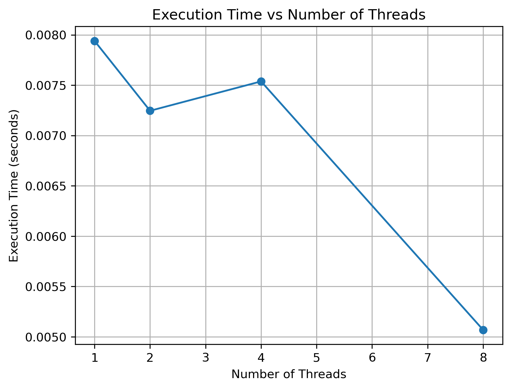
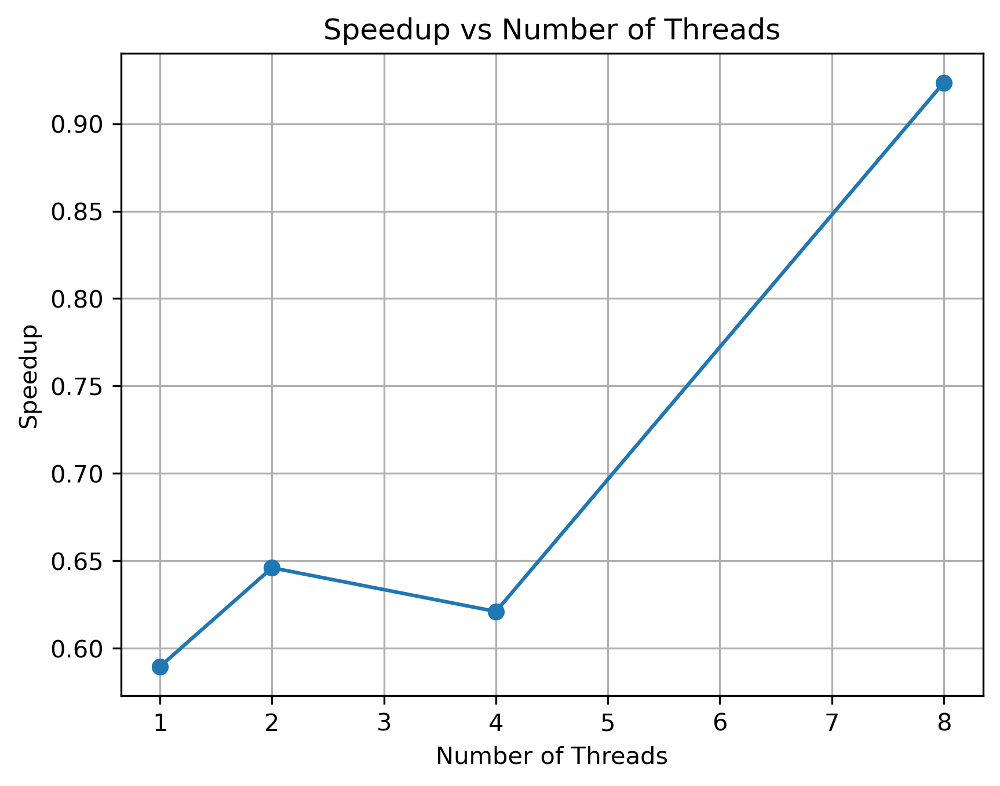
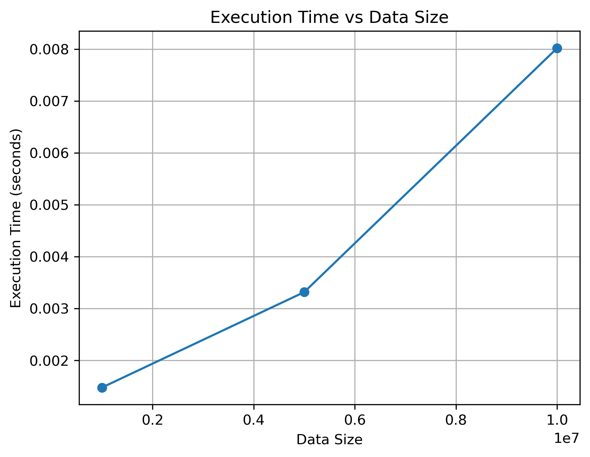

# 🚀 Parallel Maximum/Minimum Search using OpenMP

A **Parallel and Distributed Computing laboratory experiment** that finds the **maximum and minimum values in a large dataset** using sequential and OpenMP parallel processing.

The experiment compares execution time for different numbers of OpenMP threads and different dataset sizes, and calculates **speedup and efficiency** to analyze parallel performance.

---

## 📑 Table of Contents

1. [Problem Statement](#1--problem-statement)
2. [Aim](#2--aim)
3. [Objectives](#3--objectives)
4. [Configuration](#4--configuration)
5. [Architecture](#5--architecture)
6. [Execution](#6--execution)
7. [Results](#7--results)
8. [Performance Analysis](#8--performance-analysis)
9. [Tables](#9--tables)
10. [Graphs](#10--graphs)
11. [Applications](#11--applications)
12. [Conclusion](#12--conclusion)
13. [Authors](#13--authors)
14. [Project Structure](#project-structure)

---

## 1. 📝 Problem Statement

Finding the maximum and minimum values of a large dataset is a simple but useful computation for studying parallel processing.

In a sequential approach, the elements are examined one after another. In the OpenMP approach, the dataset is divided among multiple CPU threads so that different threads can search different portions of the data concurrently.

This experiment compares the sequential and OpenMP implementations by measuring execution time for different thread counts and dataset sizes.

**Speedup** and **efficiency** are also calculated to understand the effect of parallelization overhead.

---

## 2. 🎯 Aim

To implement **maximum and minimum search using OpenMP parallel processing** and compare its performance with the sequential implementation using **execution time, speedup and efficiency**.

---

## 3. 📌 Objectives

* 🔹 Find the maximum value in a large dataset.
* 🔹 Find the minimum value in a large dataset.
* 🔹 Implement the sequential maximum/minimum algorithm.
* 🔹 Implement the parallel algorithm using OpenMP.
* 🔹 Execute the program using different numbers of threads.
* 🔹 Test the program with different dataset sizes.
* 🔹 Measure execution time.
* 🔹 Calculate speedup and efficiency.
* 🔹 Generate graphs for performance analysis.
* 🔹 Analyze the effect of parallelization overhead and dataset size.

---

## 4. ⚙️ Configuration

| Component                     | Configuration       |
| ----------------------------- | ------------------- |
| 🖥️ Operating System          | Ubuntu on WSL2      |
| 💻 Programming Language       | C                   |
| 🔧 Compiler                   | GCC                 |
| 🧵 Parallel Programming Model | OpenMP              |
| 🐍 Graph Generation           | Python              |
| 📊 Graph Library              | Matplotlib          |
| 🔀 Version Control            | Git                 |
| 🌐 Repository                 | GitHub              |
| 🔢 Dataset Values             | 1 to 1,000,000      |
| 🎲 Random Seed                | 42                  |
| 📦 Main Test Size             | 10,000,000 elements |
| 🧵 Thread Counts              | 1, 2, 4 and 8       |

The fixed random seed **42** is used so that the dataset can be generated consistently during repeated executions.

---

## 5. 🏗️ Architecture

The experiment follows a simple sequential-versus-parallel architecture.

```text
                         📦 Large Dataset
                                |
                                ↓
                         🔢 Generate Data
                                |
                   +------------+------------+
                   |                         |
                   ↓                         ↓
            🖥️ Sequential              🧵 OpenMP Parallel
                Search                      Search
                   |                         |
                   ↓                         ↓
             One execution             Multiple Threads
                   |                         |
                   +------------+------------+
                                |
                                ↓
                     🔎 Minimum + Maximum
                                |
                                ↓
                       ⏱️ Execution Time
                                |
                                ↓
                    📈 Speedup & Efficiency
                                |
                                ↓
                         📊 Graphs/Analysis
```

### 🧵 OpenMP Parallel Design

The search loop is parallelized using OpenMP reduction:

```c
#pragma omp parallel for reduction(min:minimum) reduction(max:maximum)
```

Each thread searches its assigned portion of the dataset and maintains local minimum and maximum values.

OpenMP combines the partial results into the final minimum and maximum values.

---

# 6. 🧪 Execution

## 6.1 🖥️ Open Ubuntu on WSL2

Open the **Ubuntu terminal** in Windows.

First, check whether GCC is installed:

```bash
gcc --version
```

Check Python:

```bash
python3 --version
```

Check Git:

```bash
git --version
```

These commands confirm that the required tools are available.

---

## 6.2 📂 Navigate to the Project Directory

Go to the directory containing the experiment:

```bash
cd PGC-parallel-maximum-minimum-openmp
```

Check the files and folders:

```bash
ls
```

The project directory contains files/folders such as:

```text
README.md
generate_graphs.py
src
data
results
graphs
```

---

## 6.3 📁 Check the Source Files

Move into the source directory:

```bash
cd src
```

List the source files:

```bash
ls
```

The source directory contains:

```text
sequential_maxmin.c
maxmin_openmp.c
```

Return to the project root:

```bash
cd ..
```

---

## 6.4 🔨 Compile the Sequential Program

Compile the sequential C program using GCC:

```bash
gcc src/sequential_maxmin.c -o sequential_maxmin
```

If there is no compilation error, the executable file is created.

Check the project directory:

```bash
ls
```

The executable should appear as:

```text
sequential_maxmin
```

---

## 6.5 ▶️ Run the Sequential Program

Run the sequential program:

```bash
./sequential_maxmin
```

The sequential program performs the following operations:

1. 🔢 Generates the dataset.
2. 🔽 Initializes `minimum` to `INT_MAX`.
3. 🔼 Initializes `maximum` to `INT_MIN`.
4. 🔍 Traverses every element.
5. 🔽 Updates the minimum when a smaller value is found.
6. 🔼 Updates the maximum when a larger value is found.
7. 📋 Displays the final minimum and maximum values.
8. ⏱️ Measures the execution time.

For the 10,000,000-element experiment, the measured sequential execution time was:

```text
0.004681 seconds
```

This value is used later for calculating speedup.

---

## 6.6 🔨 Compile the OpenMP Program

Compile the OpenMP version using GCC.

The `-fopenmp` option enables OpenMP support.

```bash
gcc -fopenmp src/maxmin_openmp.c -o maxmin_openmp
```

If there is no compilation error, the executable `maxmin_openmp` is created.

Check the executable:

```bash
ls
```

You should see:

```text
maxmin_openmp
```

---

## 6.7 🧵 Execute OpenMP Program with 1 Thread

Set the number of OpenMP threads to **1**:

```bash
export OMP_NUM_THREADS=1
```

Check the number of threads:

```bash
echo $OMP_NUM_THREADS
```

The output should be:

```text
1
```

Run the OpenMP program:

```bash
./maxmin_openmp
```

Record the execution time.

Measured result:

```text
Threads = 1
Data Size = 10,000,000
Execution Time = 0.007940 seconds
```

---

## 6.8 🧵 Execute OpenMP Program with 2 Threads

Set the number of threads to **2**:

```bash
export OMP_NUM_THREADS=2
```

Check the setting:

```bash
echo $OMP_NUM_THREADS
```

The output should be:

```text
2
```

Run the program:

```bash
./maxmin_openmp
```

Record the execution time.

Measured result:

```text
Threads = 2
Data Size = 10,000,000
Execution Time = 0.007246 seconds
```

---

## 6.9 🧵 Execute OpenMP Program with 4 Threads

Set the number of threads to **4**:

```bash
export OMP_NUM_THREADS=4
```

Check the setting:

```bash
echo $OMP_NUM_THREADS
```

The output should be:

```text
4
```

Run the program:

```bash
./maxmin_openmp
```

Record the execution time.

Measured result:

```text
Threads = 4
Data Size = 10,000,000
Execution Time = 0.007538 seconds
```

---

## 6.10 🧵 Execute OpenMP Program with 8 Threads

Set the number of threads to **8**:

```bash
export OMP_NUM_THREADS=8
```

Check the setting:

```bash
echo $OMP_NUM_THREADS
```

The output should be:

```text
8
```

Run the program:

```bash
./maxmin_openmp
```

Record the execution time.

Measured result:

```text
Threads = 8
Data Size = 10,000,000
Execution Time = 0.005069 seconds
```

---

## 6.11 📊 Test Different Dataset Sizes

The program is also tested with different dataset sizes using **8 OpenMP threads**.

Set 8 threads:

```bash
export OMP_NUM_THREADS=8
```

Run the OpenMP program:

```bash
./maxmin_openmp
```

Repeat the experiment according to the configured dataset sizes.

The measured results are:

|  Data Size | Threads | Minimum |   Maximum | Execution Time (s) |
| ---------: | ------: | ------: | --------: | -----------------: |
|  1,000,000 |       8 |       1 | 1,000,000 |           0.001475 |
|  5,000,000 |       8 |       1 | 1,000,000 |           0.003315 |
| 10,000,000 |       8 |       1 | 1,000,000 |           0.008019 |

---

## 6.12 📝 Record the Execution Results

Record the execution time for each thread configuration.

The collected thread-scaling results are:

| Threads |  Data Size | Execution Time (s) |
| ------: | ---------: | -----------------: |
|       1 | 10,000,000 |           0.007940 |
|       2 | 10,000,000 |           0.007246 |
|       4 | 10,000,000 |           0.007538 |
|       8 | 10,000,000 |           0.005069 |

The lowest measured parallel execution time is obtained using **8 threads**.

---

## 6.13 🧮 Calculate Speedup

Speedup is calculated using:

```text
Speedup = Sequential Time / Parallel Time
```

The sequential execution time for 10,000,000 elements is:

```text
0.004681 seconds
```

For 8 threads:

```text
Speedup = 0.004681 / 0.005069
        = 0.9235
```

The same calculation is performed for all thread configurations.

---

## 6.14 📐 Calculate Efficiency

Efficiency is calculated using:

```text
Efficiency = (Speedup / Number of Threads) × 100
```

For 8 threads:

```text
Efficiency = (0.9235 / 8) × 100
           = 11.54%
```

The same calculation is performed for 1, 2, 4 and 8 threads.

---

## 6.15 🐍 Generate Performance Graphs

After collecting the execution-time results, generate the performance graphs using Python and Matplotlib.

Make sure you are in the project root directory:

```bash
cd PGC-parallel-maximum-minimum-openmp
```

Run:

```bash
python3 generate_graphs.py
```

The generated graphs are stored in the `graphs/` directory.

The experiment contains:

```text
graphs/
├── execution_time_vs_threads.png
├── speedup_vs_threads.png
└── execution_time_vs_data_size.png
```

📌 **The graphs are already pushed to the GitHub repository and do not need to be added again.**

---

## 6.16 📁 Check the Results Files

Check the results directory:

```bash
ls results
```

The results directory contains:

```text
thread_results.csv
data_size_results.csv
speedup_efficiency.csv
analysis.txt
```

These files contain the recorded execution results and performance analysis.

---

# 7. 📊 Results

## 7.1 🧵 Thread Scaling Results

The experiment was performed using **10,000,000 elements**.

| Threads |  Data Size | Execution Time (s) |
| ------: | ---------: | -----------------: |
|       1 | 10,000,000 |           0.007940 |
|       2 | 10,000,000 |           0.007246 |
|       4 | 10,000,000 |           0.007538 |
|       8 | 10,000,000 |           0.005069 |

The lowest measured parallel execution time was obtained using **8 threads: 0.005069 seconds**.

---

## 7.2 📦 Data Size Results

The following experiment uses **8 OpenMP threads**.

|  Data Size | Threads | Minimum |   Maximum | Execution Time (s) |
| ---------: | ------: | ------: | --------: | -----------------: |
|  1,000,000 |       8 |       1 | 1,000,000 |           0.001475 |
|  5,000,000 |       8 |       1 | 1,000,000 |           0.003315 |
| 10,000,000 |       8 |       1 | 1,000,000 |           0.008019 |

The minimum and maximum values are correctly identified as **1** and **1,000,000** for the tested datasets.

---

# 8. 📈 Performance Analysis

The sequential execution time for 10,000,000 elements was:

```text
0.004681 seconds
```

## ⚡ Speedup

```text
Speedup = Sequential Time / Parallel Time
```

## 📐 Efficiency

```text
Efficiency = (Speedup / Number of Threads) × 100
```

| Threads | Sequential Time (s) | Parallel Time (s) | Speedup | Efficiency (%) |
| ------: | ------------------: | ----------------: | ------: | -------------: |
|       1 |            0.004681 |          0.007940 |  0.5895 |          58.95 |
|       2 |            0.004681 |          0.007246 |  0.6460 |          32.30 |
|       4 |            0.004681 |          0.007538 |  0.6210 |          15.52 |
|       8 |            0.004681 |          0.005069 |  0.9235 |          11.54 |

### 🔍 Analysis

* 🧵 The **8-thread configuration** produced the lowest measured parallel execution time.
* 📉 The speedup remains below **1** for all tested configurations.
* ⚙️ The sequential search is a very small computation, so OpenMP thread creation, scheduling and reduction introduce noticeable overhead.
* 🧵 Increasing the number of threads does not automatically produce proportional speedup.
* 📦 The data-size experiment shows that execution time increases as the number of elements increases because every element must be examined.
* 💡 The experiment demonstrates that useful parallel performance depends on the amount of computation relative to parallelization overhead.

---

# 9. 📋 Tables

## Table 1 — 🧵 Thread Scaling

| Threads |  Data Size | Time (s) |
| ------: | ---------: | -------: |
|       1 | 10,000,000 | 0.007940 |
|       2 | 10,000,000 | 0.007246 |
|       4 | 10,000,000 | 0.007538 |
|       8 | 10,000,000 | 0.005069 |

---

## Table 2 — 📦 Data Size Scaling

|  Data Size | Threads | Minimum |   Maximum | Time (s) |
| ---------: | ------: | ------: | --------: | -------: |
|  1,000,000 |       8 |       1 | 1,000,000 | 0.001475 |
|  5,000,000 |       8 |       1 | 1,000,000 | 0.003315 |
| 10,000,000 |       8 |       1 | 1,000,000 | 0.008019 |

---

## Table 3 — ⚡ Speedup and Efficiency

| Threads | Speedup | Efficiency (%) |
| ------: | ------: | -------------: |
|       1 |  0.5895 |          58.95 |
|       2 |  0.6460 |          32.30 |
|       4 |  0.6210 |          15.52 |
|       8 |  0.9235 |          11.54 |

---

# 10. 📉 Graphs

📌 **The graph files are already present in the project. This section only displays/references them; the graphs do not need to be pushed again.**

## 10.1 ⏱️ Execution Time vs Number of Threads

This graph shows how execution time changes when the number of OpenMP threads is increased.



---

## 10.2 ⚡ Speedup vs Number of Threads

This graph shows the speedup obtained for different numbers of OpenMP threads.



---

## 10.3 📦 Execution Time vs Data Size

This graph shows how execution time changes as the dataset size increases.



---

# 11. 💡 Applications

Maximum/minimum search is used in many real-world data-processing tasks, including:

* 🌡️ Finding highest and lowest sensor readings.
* 🔬 Identifying maximum/minimum values in scientific datasets.
* 💰 Processing financial or transaction data.
* 🖼️ Image and video data analysis.
* 🔢 Finding extreme values in large numerical datasets.
* 📊 Preprocessing and statistical analysis in data science applications.
* 🧵 Parallel data-processing workloads where large arrays must be scanned.

---

# 12. 🏁 Conclusion

The experiment successfully implements **maximum and minimum search** using both sequential C and OpenMP parallel processing.

The program was tested with different numbers of threads and different dataset sizes. Execution time, speedup and efficiency were calculated and visualized using graphs.

The results show that the **8-thread configuration gave the lowest measured parallel execution time**, but the speedup remained below 1 because the maximum/minimum search performs very little computation compared with the overhead of creating and managing OpenMP threads and combining reduction results.

The data-size experiment also shows that execution time increases as the dataset size increases.

Overall, the experiment demonstrates the importance of considering both **computation size and parallelization overhead** when evaluating OpenMP performance.

---

# 👩‍💻 13. Authors

### 👩‍💻 Monika M. Bhandari

### 👩‍💻 Krupa Akki

### 👩‍💻 Srujana V. B.

### 👩‍💻 Srujana Patil

---

# 📁 Project Structure

```text
PGC-parallel-maximum-minimum-openmp/
│
├── README.md
├── generate_graphs.py
│
├── src/
│   ├── sequential_maxmin.c
│   └── maxmin_openmp.c
│
├── data/
│
├── results/
│   ├── thread_results.csv
│   ├── data_size_results.csv
│   ├── speedup_efficiency.csv
│   └── analysis.txt
│
├── graphs/
│   ├── execution_time_vs_threads.png
│   ├── speedup_vs_threads.png
│   └── execution_time_vs_data_size.png
│
└── presentation/
```

---

## 🚀 GitHub Update

Since your **graphs and screenshots are already pushed**, update only the README:

```bash
git add PGC-parallel-maximum-minimum-openmp/README.md
git commit -m "Update OpenMP max-min README"
git push origin main
```
